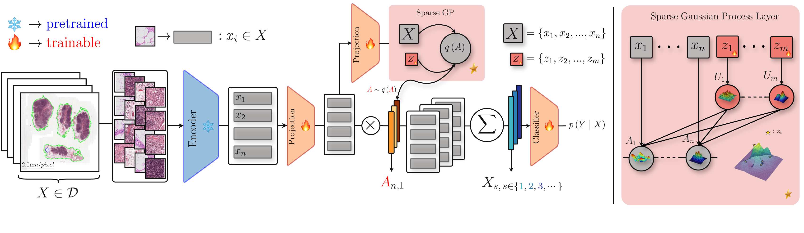

# **SGPMIL**: Sparse Gaussian Process Multiple Instance Learning

> **Update:** This work has been accepted to **WACV 2026**.
> 📄 **Preprint:** https://arxiv.org/abs/2507.08711



This repository contains the official implementation and supporting materials for our paper.

## Overview

Sparse Gaussian Process Multiple Instance Learning (SGPMIL) is a probabilistic attention-based framework for Multiple Instance Learning (MIL), designed to provide calibrated predictions and interpretable attention scores at both bag and instance levels. Built upon Sparse Gaussian Processes, SGPMIL addresses key limitations of prior probabilistic MIL approaches, including training instability, poor instance-level localization, and computational inefficiency.

The framework introduces three key improvements: (1) a learnable feature-scaling term in the variational posterior mean, (2) a relaxed sigmoid-based attention normalization strategy, and (3) a diagonal covariance approximation to accelerate and stabilize training. These modifications enhance optimization over kernel hyperparameters and inducing point locations while preserving predictive performance.

SGPMIL is evaluated on a wide range of histopathology benchmarks, including CAMELYON16, TCGA-NSCLC, BRACS, and PANDA, showing strong results in both bag-level classification and instance-level performance. The method provides an efficient, scalable, and theoretically grounded solution for high-dimensional MIL tasks.

## Structure

The repository is organized as follows:
```
├── configs # Model and dataset configuration files
├── dataset_dependent # Dataset-specific splits and related configurations
├── scripts # Evaluation scripts (slide-level and instance-level)
├── src # Source code (models, training, and validation logic)
│ └── main.py # Entry point for training and validation using PyTorch Lightning
└── README.md
```

### Installation

Option 1 – using pip:
```bash
# 1. Create a clean conda or venv environment
conda create -n sgpmil python=3.10 -y
conda activate sgpmil
# 2. Install OpenSlide system libraries (required for WSI)
# Linux:
sudo apt-get install -y openslide-tools libopenslide0
# 3. Install Python dependencies
pip install -r requirements.txt
```

Option 2 - using conda:
```bash
conda env create -f environment.yaml
conda activate sgpmil
```

## Training

To train a model using one of the provided configurations:

```bash
python src/main.py --config /path/to/config.yaml
```

## Evaluation
Slide-level evaluation:
```bash
CUDA_VISIBLE_DEVICES=0 python eval.py \
    --config /path/to/config.yaml \
    --savedir /path/to/save/metrics \
    --k_folds [0,1,2,3,4,5,6,7,8,9]
```

Instance-level evaluation:
```bash
python model_predictions.py \
    --config /path/to/config.yaml \
    --savedir /path/to/save/results \
    --slide_dir /path/to/images \
    --annotations_dir /path/to/annotations \
    --shape_file /path/to/shapes.txt \
    --mask_dir /path/to/masks \
    --inference --compute_masks --compare_masks --overlay_masks
```

## Paper

If you use this repository or find it helpful, please cite our paper:

```bibtex
@misc{lolos2025sgpmilsparsegaussianprocess,
      title={SGPMIL: Sparse Gaussian Process Multiple Instance Learning}, 
      author={Andreas Lolos and Stergios Christodoulidis and Maria Vakalopoulou and Jose Dolz and Aris Moustakas},
      year={2025},
      eprint={2507.08711},
      archivePrefix={arXiv},
      primaryClass={cs.CV},
      url={https://arxiv.org/abs/2507.08711}
}
```

## License

This code is released under a modified MIT License for non-commercial use.  
See [LICENSE](./LICENSE.txt) for details.

For commercial licensing inquiries, please contact the authors after the review process.

## Acknowledgements & External Code

This repository builds upon publicly available MIL implementations to ensure fair and reproducible benchmarking.  
Where applicable, we incorporated or adapted components from the following official repositories:

- **TransMIL**
- **BayesMIL / Bayesian MIL**
- **ABMIL / CLAM**
- **Trident** — used for WSI segmentation, patching, and feature extraction  
- **CLAM** — some preprocessing utilities (masking, tiling logic) adapted for compatibility

Additional acknowledgements and references will be added as the repository is expanded.

